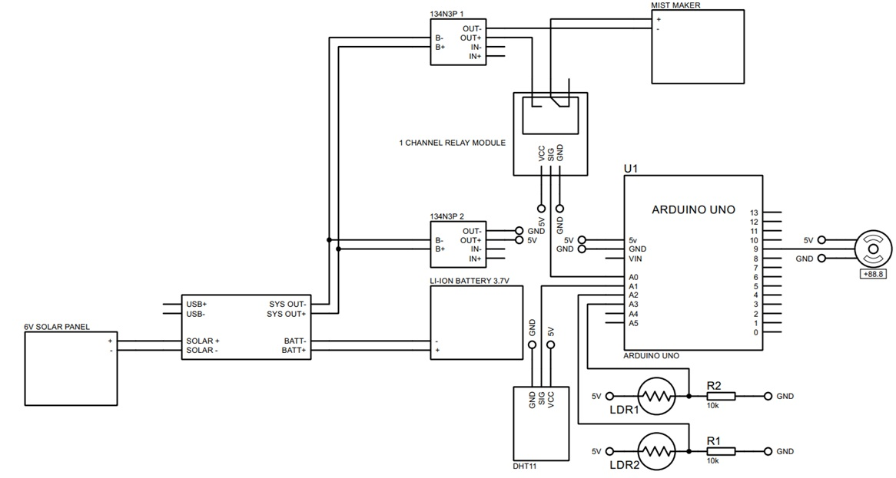

# Solar Tracking Plant Care System (Arduino)

This project is a small-scale automated plant care system that combines **solar tracking** and **misting control** using an Arduino. It is designed to maximize sunlight exposure for a small solar panel while maintaining a suitable environment for plants through temperature-based misting.

---

## Project Overview

The system uses two light sensors (LDRs) to detect the direction of sunlight and automatically adjusts the position of a solar panel using a servo motor. At the same time, it monitors temperature using a DHT11 sensor and activates a misting device when the temperature drops below a defined threshold.

This project is ideal for:
- small greenhouse setups  
- plant monitoring prototypes  
- solar-powered IoT experiments  

---

## Features

- ☀️ **Solar Tracking**
  - Uses two LDR sensors to detect light intensity
  - Automatically rotates the solar panel toward the strongest light source
  - Controlled using a servo motor

- 🌡️ **Temperature Monitoring**
  - Uses DHT11 sensor to read temperature
  - Outputs data via serial monitor

- 💧 **Automatic Misting System**
  - Activates mist maker when temperature is below threshold
  - Helps maintain plant humidity and cooling

- 🔋 **Solar-Powered Design**
  - Powered by a small solar panel with battery backup
  - Designed for low-power operation

---

## How It Works

### Solar Tracking Logic

The system continuously reads values from two LDR sensors:
- Left LDR  
- Right LDR  

If the difference between the two exceeds a defined threshold, the servo motor adjusts the position of the solar panel toward the brighter side.

This ensures that the panel always faces the direction of maximum sunlight.

---

### Misting Control Logic

The system reads temperature using the DHT11 sensor:
- If temperature is below the defined minimum (`TEMP_LOWEST`) → misting system turns ON  
- Otherwise → misting system turns OFF  

This helps regulate the environment for plants, especially in controlled setups.

---

## Pin Configuration

| Component       | Arduino Pin |
|----------------|------------|
| Mist Maker     | A0         |
| DHT11 Sensor   | A1         |
| LDR Left       | A2         |
| LDR Right      | A3         |
| Servo Motor    | 9          |

---

## Hardware Components

- Arduino Uno  
- Servo Motor  
- DHT11 Temperature Sensor  
- 2x LDR (Light Dependent Resistors)  
- 10k Resistors (for voltage divider)  
- Mist Maker Module  
- 1-Channel Relay Module  
- Small Solar Panel (6V)  
- Li-ion Battery (3.7V)  
- Charging/Protection Modules (CN3065)

---

## Circuit Diagram

The wiring diagram for this project includes:

- A **6V solar panel** connected to a charging module  
- A **Li-ion battery** for energy storage  
- The **Arduino Uno** as the main controller  
- A **relay module** to control the mist maker  
- Two **LDR sensors** configured as voltage dividers  
- A **servo motor** to adjust solar panel orientation  
- A **DHT11 sensor** for temperature monitoring  

📄 See full diagram here:  
:contentReference[oaicite:0]{index=0}  

---

## Notes

- This project uses a **threshold-based tracking algorithm**, not PID control  
- Servo movement is gradual to prevent sudden motion  
- The misting system is controlled only by temperature (no humidity sensing)  
- Designed for **small solar panels and lightweight applications**  

---

## Limitations

- DHT11 has limited accuracy compared to more advanced sensors  
- LDR sensors may be affected by ambient lighting conditions  
- No remote monitoring or IoT integration in this version  
- Not suitable for large-scale solar tracking systems  

---

## Summary

This project demonstrates a simple integration of:
- solar tracking using light sensors  
- environmental control using temperature-based misting  
- automation using Arduino  

It serves as a prototype for **smart agriculture**, **solar-powered plant care**, and **embedded system applications**.

## Summary

